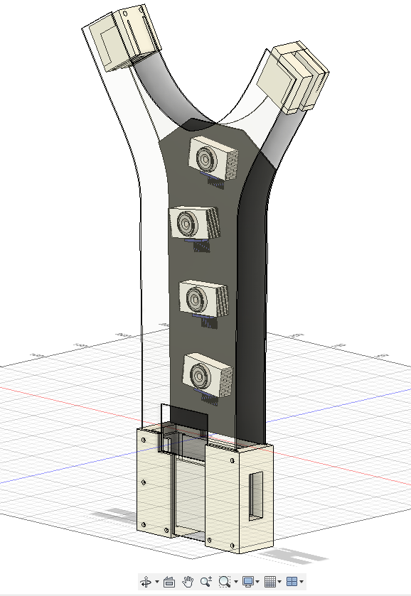
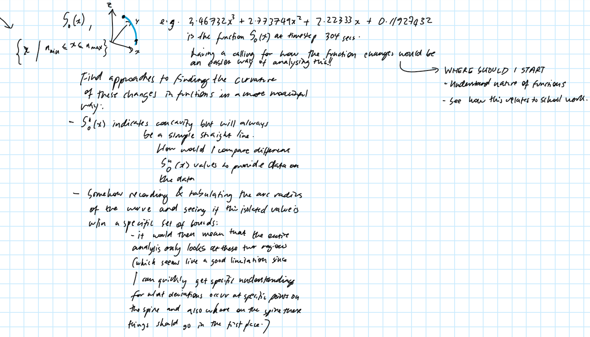
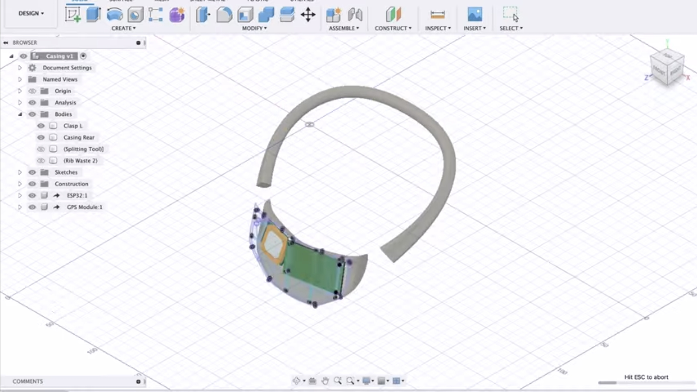

## D.T. Essence
Designing a posture correction device aimed at heightening the awareness of users through haptic feedback and continual monitoring. My aim is to encourage user awareness of their posture and thus user autonomy on how they should approach treatments/exercises - hoping to alleviate the stress on healthcare systems by providing a preventative solution to spinal monitoring. 

## D.T. Progression 
*These are the rest of the points that need completion before the end of the holidays. After this is all done, I will be focusing on testing and minor iterations in D.T. lessons - but most of the time being spent on applications and making sure my other subjects are perfect.*

--------------

**Sections:**
- Cubic spline monitoring: *Converting the inputted sensor data into something that replicates the spine.*
- Aesthetics: *Trying to consider what it is users actually want, and abstracting the complexity such that users can focus on the data and not how it works.*
- Research & Outreach: *Reaching out to users and researchers to the improvements of the initial models that I have, with corresponding deadlines to each of these goals so that there is constant momentum in my work.*

--------------

1. Cubic Spline
*There is a OneNote page with works on this (screenshotted below):*

    - Understand how to produce dynamic cubic splines 
    - Understand how to have splines in 3D
    - How to adjust the parameters of the spline to fit the shape of the spine (**I will develop the basis of this, then reach out to see if people are working on - or know about - what shape the spine specifically holds, and which anchor points would help to provide a better approximation. I only have three sensors for this, so there will be a lot of error but it will be good to start with**)
    - Feedback on the deviancy of "good posture" (**Focusing on the feedback aspect, asking researchers for the help on the definition of a "good posture" in the firtst place.**)

2. Aesthetics 
    - Current sketches although promising are not developed to any depth
    - There has been no CAD work over the holidays & the shrinking of the component distribution to be thin across the body has been neglected
    - The sketches produced can very quickly and easily be iterated to something I am more proud of

    
    
3. Human Centered Modelling (seeing how to make this accurate; reaching out to professionals)
    - Complete the technical background for the cubic spline then reach out for help on the positioning of the sensors on the back and how to read that someone is slouching (that is mathematical but I need the medical intuition even if I do know the maths)
    - Send this off to researchers in the UK to see whether I can work on this in a lab for a week and have some industry guidance; talk to some people on LinkedIn to check out the project and see what's up
        - Area: robotics, bioengineering, information engineering, design engineering